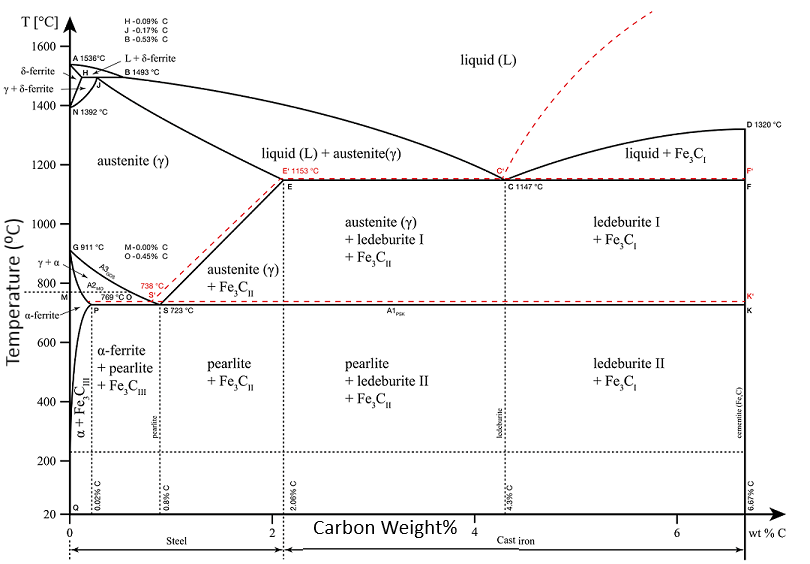

# Fe-C Phase Diagram Viewer

An interactive viewer built using `tkinter` to explore the Iron-Carbon Phase Diagram. As the cursor moves over the diagram, it displays the carbon content and temperature based on the image coordinates.

## What is the Fe–C Phase Diagram?

The Fe–Fe₃C (iron–iron carbide) phase diagram is a fundamental tool in materials science and metallurgy. It helps explain the relationship between:

- **Temperature**
- **Carbon concentration**
- **Phases present in iron–carbon alloys**

This diagram is essential for understanding steel and cast iron production, as it shows the stable phases (like ferrite, austenite, cementite) at various compositions and temperatures. Engineers and scientists use it to predict material properties and design heat treatments for steel.

This app allows interactive exploration of this phase diagram.

## Features

- Displays real-time cursor position in:
  - **Carbon wt%**
  - **Temperature (°C)**
- Restricts values to the actual axes of the diagram.
- Highlights cursor location with a red circle.

## Screenshot



## Requirements

- Python 3.x
- [Pillow](https://pypi.org/project/Pillow/)

Install with:

```bash
pip install pillow
```

## How to Run

Simply execute:

```bash
python fe_c_phase_viewer.py
```

## Author

Published from Spyder 3.1.4.
